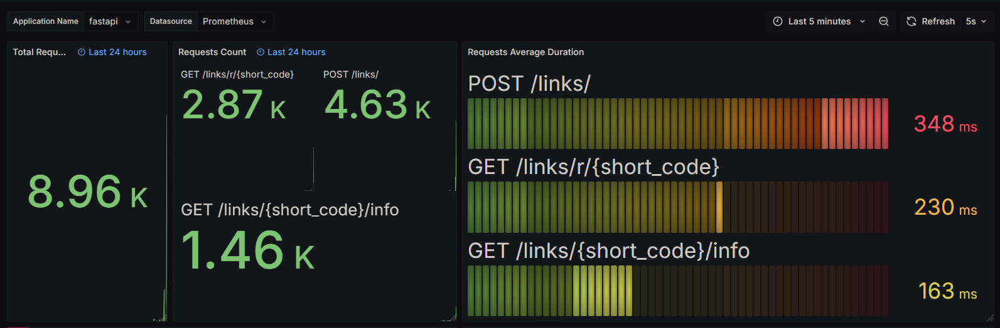

# Short URL API
> [!NOTE]
> **Учебный backend-проект** на FastAPI для создания коротких ссылок с использованием SQLAlchemy 2.0, Prometheus, Grafana и Docker.

## 📌 Описание проекта

**Short URL API** — это backend-сервис для создания коротких ссылок (short URL) с возможностью отслеживания статистики и интеграции с Prometheus для мониторинга. В проекте реализованы три основных эндпоинта:

1. **Создание шорт-кода** для оригинальной ссылки (с возможностью генерации случайного кода длиной от 3 до 10 символов или указания пользователем уникального кода).
2. **Редирект** на оригинальную ссылку по шорт-коду.
3. **Получение статистики** по шорт-коду: оригинальная ссылка, количество переходов, дата создания и дата последнего перехода.

Проект полностью контейнеризирован с использованием **Docker** и **Docker Compose** и включает 4 контейнера: API, база данных для хранения ссылок, **Prometheus** для мониторинга и **Grafana** для визуализации данных.

## ⚙️ Основной функционал:
### 1. 📄 Шорт-коды:
- Генерация уникальных шорт-кодов для длинных ссылок.
- Поддержка как случайной генерации кода, так и ручного ввода уникального кода пользователем.

### 2. 🔄 Редирект:
- Возможность редиректа на оригинальную ссылку по шорт-коду.

### 3. 📊 Статистика:
- Статистика по шорт-коду: оригинальная ссылка, количество переходов, дата создания, дата последнего перехода.

### 4. 📈 Мониторинг:
- Интеграция с **Prometheus** для сбора метрик.
- **Grafana** для визуализации графиков с метриками.

## 🧠 База данных:
- **SQLAlchemy 2.0** для работы с базой данных.
- **Alembic** для управления миграциями.
- Система хранит короткие и оригинальные ссылки с подсчетом статистики по переходам.

## 🐳 Docker-окружение:
Проект полностью контейнеризирован и использует **Docker Compose** для упрощения развертывания:

- **API** (FastAPI-приложение)
- **PostgreSQL** (База данных для хранения ссылок)
- **Prometheus** (Для сбора метрик)
- **Grafana** (Для отображения метрик)

## 🚀 Запуск проекта:
1. **Клонируйте репозиторий:**
   ```bash
   git clone https://github.com/L1inkoln/short-url.git
   cd short-url
   
2. **Запустите проект: docker compose up --build**

3. **Доступ к API и сервисам:**

 - *API будет доступен на порту 8000.*
  
 - *Prometheus на порту 9090.*
  
 - *Grafana на порту 3000.*

4. **Настройка мониторинга в grafana:**
   
- *Перейти на localhost:3000*
   
- *Залогиниться с admin:admin*
   
- *Настроить dashboard*

## 📷 Пример мониторинга с нагрузкой 80rps на 1 воркере:


## 💡 Советы:
*В случае необходимости изменения настроек базы данных или других параметров, обновите .env файл.*

*Используйте Grafana для визуализации статистики и метрик.*